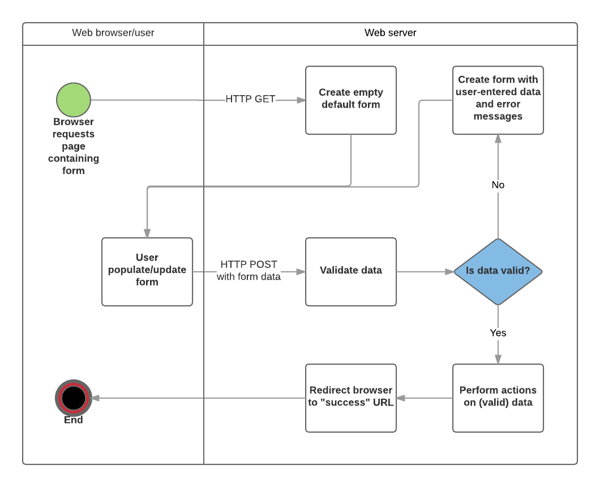

# Express Validation Learning Project

A modern, full-stack Express.js application demonstrating **input validation** and **data sanitization** using the `express-validator` library. Built with a clean MVC architecture, responsive UI, and comprehensive form validation.



## 📋 Table of Contents

- [Features](#features)
- [Tech Stack](#tech-stack)
- [Project Structure](#project-structure)
- [Installation](#installation)
- [Running the App](#running-the-app)
- [API Endpoints](#api-endpoints)
- [Validation Rules](#validation-rules)
- [Learning Concepts](#learning-concepts)
- [Best Practices](#best-practices)

## ✨ Features

- ✅ **User Management** - Create, Read, Update, Delete (CRUD) operations
- 🔐 **Input Validation** - Comprehensive form validation with error messages
- 🧹 **Data Sanitization** - Trim, escape, and normalize user input
- 🎨 **Modern UI** - Bootstrap 5 with responsive design
- 📱 **Responsive Design** - Mobile-friendly interface
- ⚠️ **XSS Protection** - Automatic HTML escaping in EJS templates
- 🎯 **MVC Architecture** - Separation of concerns (Models, Views, Controllers)
- 📊 **Data Storage** - In-memory user storage (easily swap for database)

## 🛠️ Tech Stack

| Layer | Technology |
|-------|-----------|
| **Frontend** | EJS, Bootstrap 5, HTML5, CSS3 |
| **Backend** | Node.js, Express.js |
| **Validation** | express-validator |
| **Icons** | Font Awesome 6 |
| **Architecture** | MVC Pattern |

## 📁 Project Structure

```
express_validation/
├── app.js                          # Main Express application
├── package.json                    # Dependencies
├── controllers/
│   ├── homeController.js          # Home page controller
│   └── usersController.js         # Users CRUD controller
├── routes/
│   ├── homeRoutes.js              # Home route definitions
│   └── usersRouter.js             # Users route definitions
├── views/
│   ├── index.ejs                  # Users list page
│   ├── createUser.ejs             # Create user form
│   ├── updateUser.ejs             # Update user form
│   └── partials/
│       ├── header.ejs             # Navbar & styles
│       ├── footer.ejs             # Bootstrap JS
│       └── errors.ejs             # Error display component
├── storages/
│   └── usersStorage.js            # In-memory data storage
└── README.md                       # This file
```

## 🚀 Installation

### Prerequisites
- Node.js (v14 or higher)
- npm or yarn

### Setup Steps

1. **Navigate to the project:**
   ```bash
   cd /home/reda/preparation/express_validation
   ```

2. **Install dependencies:**
   ```bash
   npm install
   ```

3. **Start the server:**
   ```bash
   npm start
   ```
   
   Or for development with auto-reload:
   ```bash
   npm run dev
   ```

4. **Open in browser:**
   ```
   http://localhost:3000
   ```

## 🌐 Running the App

### Production Mode
```bash
npm start
```
Server runs on `http://localhost:3000`

### Development Mode (with auto-reload)
```bash
npm run dev
```
Uses nodemon for automatic restart on file changes.

## 📡 API Endpoints

### Users Routes
| Method | Endpoint | Description |
|--------|----------|-------------|
| GET | `/` | List all users |
| GET | `/create` | Show create user form |
| POST | `/create` | Create new user (with validation) |
| GET | `/:id/update` | Show update user form |
| POST | `/:id/update` | Update user (with validation) |
| POST | `/:id/delete` | Delete user |

## ✔️ Validation Rules

### User Creation & Update

| Field | Rules | Error Message |
|-------|-------|---------------|
| **firstName** | Required, letters only, 1-10 chars | "must only contain letters" |
| **lastName** | Required, letters only, 1-10 chars | "must only contain letters" |
| **email** | Required, valid email format | "must be in this form example@mail.com" |
| **age** | Required, integer, 18-100 range | "must be an integer between 18 and 100" |
| **bio** | Optional, max 200 characters | "must be between 0 and 200" |

### Validation Code Example

```javascript
const validateUser = [
  body("firstName").trim()
    .isAlpha().withMessage(`First name must only contain letters.`)
    .isLength({ min: 1, max: 10 }).withMessage(`First name must be between 1 and 10 characters.`),
  body("email").trim()
    .isEmail().withMessage(`Email must be in this form example@mail.com`),
  body("age")
    .isInt({ min: 18, max: 100 })
    .withMessage("Age must be an integer between 18 and 100"),
];
```

## 📚 Learning Concepts

### 1. **Validation vs Sanitization**

```javascript
// VALIDATION - Check if data is correct format
body("email").isEmail()  // Must be valid email

// SANITIZATION - Clean the data
body("firstName").trim()  // Remove whitespace
body("email").toLowerCase()  // Normalize case
body("age").toInt()  // Convert to number
```

### 2. **Validation in Router/Middleware (Not Controller)**

```javascript
// ✅ GOOD - Validate in routes
router.post('/create',
  [body('email').isEmail()],  // Validate here
  controller.create
);

// ❌ BAD - Don't validate in controller
exports.create = (req, res) => {
  if (!req.body.email.includes('@')) { }  // Wrong place!
};
```

### 3. **Error Handling**

```javascript
const errors = validationResult(req);
if (!errors.isEmpty()) {
  return res.status(400).render('form', {
    errors: errors.array()  // Pass errors to view
  });
}
```

### 4. **Data Security - XSS Protection**

```ejs
<!-- ✅ SAFE - Automatically escapes HTML -->
<p><%= userInput %></p>

<!-- ❌ UNSAFE - Raw HTML output -->
<p><%- userInput %></p>
```

### 5. **MVC Architecture**

```
Request Flow:
1. Route receives request
2. Validator middleware checks data
3. Controller handles business logic
4. View renders response
```

## 🎯 Best Practices Demonstrated

| Practice | Implementation |
|----------|-----------------|
| **Separation of Concerns** | Controllers handle logic, routes handle validation, views handle display |
| **Input Validation** | All user input validated before processing |
| **Data Sanitization** | Input trimmed, escaped, and normalized |
| **Error Handling** | Comprehensive error messages shown to user |
| **XSS Protection** | EJS auto-escapes by default with `<%= %>` |
| **Consistency** | Validation rules applied to all forms |
| **Reusability** | Validation array can be reused across routes |
| **Security** | Never trust user input, always validate |

## 💡 Common Validation Methods

```javascript
// Text validation
body('name').notEmpty()              // Required field
body('name').isLength({ min: 2 })    // Min length
body('name').isAlpha()               // Only letters
body('name').matches(/pattern/)      // Regex pattern

// Email/URL validation
body('email').isEmail()              // Valid email
body('url').isURL()                  // Valid URL

// Number validation
body('age').isInt()                  // Integer
body('age').isInt({ min: 18 })       // Min value

// Sanitization
body('name').trim()                  // Remove whitespace
body('email').toLowerCase()          // Lowercase
body('bio').escape()                 // Escape HTML
body('age').toInt()                  // Convert to integer

// Custom validation
body('username').custom(value => {
  return User.findOne({username: value})
    .then(user => {
      if (user) return Promise.reject('User already exists');
    });
})
```

## 🔧 Customization

### Add New Validation Rule

```javascript
// In routes/usersRouter.js
const validateUser = [
  // ... existing rules
  body("phone")
    .isMobilePhone('en-US')
    .withMessage("must be a valid US phone number"),
];
```

### Store Data in Database

Replace `usersStorage.js` with your database connection:
```javascript
// Instead of in-memory storage
const User = require('../models/User');

exports.addUser = async (userData) => {
  const user = new User(userData);
  return user.save();
};
```

### Add More Fields

1. Update HTML form inputs
2. Add validation rules to `validateUser` array
3. Update controller to handle new fields
4. Update table/display in views

## 📖 Resources

- [Express Validator Docs](https://express-validator.github.io/)
- [Express.js Guide](https://expressjs.com/)
- [OWASP Input Validation](https://cheatsheetseries.owasp.org/cheatsheets/Input_Validation_Cheat_Sheet.html)
- [Bootstrap 5 Docs](https://getbootstrap.com/docs/5.0/)

## 🤝 Contributing

This is a learning project. Feel free to:
- Add more validation rules
- Improve the UI design
- Add a real database
- Implement authentication
- Add more CRUD features

## 📝 Notes

- Data is stored **in-memory**, so it's lost when the server restarts
- This is a **learning project**, not production-ready
- For production, use a real database (MongoDB, PostgreSQL, etc.)
- Consider adding authentication and more advanced security features

## 🎓 What You Learned

✅ Creating Express applications  
✅ Form validation with express-validator  
✅ Data sanitization and cleaning  
✅ MVC architecture pattern  
✅ EJS templating  
✅ Bootstrap styling  
✅ Security best practices (XSS prevention)  
✅ Error handling and validation feedback  

---

**Happy Learning!** 🚀 Feel free to explore, modify, and extend this project!
```

### 2. **sanitization**
```javascript
body('name').trim()  // Remove whitespace
```

### 3. **Check Results**
```javascript
const errors = validationResult(req);
if (!errors.isEmpty()) {
  // Handle validation errors
}
```

### 4. **Middleware Chain**
- **Validation Rules**: Applied to request data
- **Error Checking Middleware**: Stops execution if errors found
- **Controller Handler**: Only executes if validation passes

## Common Validation Methods

| Method | Purpose |
|--------|---------|
| `.notEmpty()` | Field must have a value |
| `.isEmail()` | Must be valid email format |
| `.isInt()` | Must be an integer |
| `.isLength()` | Check string length |
| `.trim()` | Remove whitespace |
| `.escape()` | Escape special characters |
| `.custom()` | Custom validation logic |

## Learning Path

1. **Understand the flow**: Request → Validation → Error Check → Controller
2. **Modify validation rules**: Try adding more complex validations
3. **Add custom validators**: Use `.custom()` for unique business logic
4. **Combine multiple rules**: Chain validators for comprehensive checks

## Testing

Use your preferred tool to test:
- **cURL** (command line)
- **Postman** (GUI)
- **REST Client** (VS Code extension)
- **Thunder Client** (VS Code extension)
